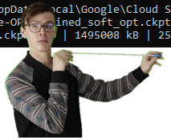

# Paraphrase OPT

Training OPT for paraphrasing through prompt engineering.

It seems like GPT3 will perform quite well with just telling it directly to paraphrase the following sentence, and
bumping up the frequency and presence penalties.

However, OPT's smaller variants (125m & 350m) do not seem to be able to understand the prompt "paraphrase:" and instead
attempt to continue the sentence:

```
'Once, a group of frogs was roaming around the forest in search of water. 
Paraphrase: "I\'m thirsty."\n\nThe group of frogs was so thirsty that they were unable 
to find water.\n\nThe group of frogs was'
```

Trying 13B gives this result:
```
RuntimeError: CUDA out of memory. Tried to allocate 100.00 MiB (GPU 0; 39.59 GiB total capacity; 37.53 GiB already allocated; 22.19 MiB free; 37.53 GiB reserved in total by PyTorch) If reserved memory is >> allocated memory try setting max_split_size_mb to avoid fragmentation.  See documentation for Memory Management and PYTORCH_CUDA_ALLOC_CONF
```

# Current Implementation

Copy pasted soft prompt tuning and created a huggingface model wrapper around OPT for it. It seems to be working.
Emphasis on *seems*.


TODO:
- [ ] Run model benchmarks on google cloud using GPUs
- [ ] Finish up C-backend integration of OGDF FMMM algorithm for initial point placements 
  (use https://github.com/N-Coder/ogdf-python library)
- [ ] Fine tune model directly on paraphrasing.
- [ ] Build the model for fine tuning directly on the paraphrase dataset. (Use existing implementation? Use huggingface trainer?)
- [ ] profit???

I had some time while waiting for the checkpoint to download



# Sprint Review
BartScore (compare to BertScore)
Why is it good
Parabank was done on parallel language pairs > can be extended to like indonesian multilingual datasets
provided we have a parallel dataset > we can train our own bartscore on different languages


# Ideas

Given that OPT is a decoder only model, how will we get it to perform what is traditionally considered a seq-2-seq task
which involves cross attention from the encoder outputs, transforming the input sequence into an output sequence of a
different phrasing. The function of the encoder output cross attention is for the model to maintain a strong reference
point to the original sequence while predicting the next tokens, which is better than appending the input to the start
of the sequence and referring to the causal mask of the decoder sequence since the encoder and decoder embedding spaces
no longer have to be aligned.

## Soft Prompt Tuning

[Parameter Efficient Soft Prompt Tuning](https://arxiv.org/pdf/2104.08691.pdf) seems to be the original implementation
that was not referenced in the DART paper. The codebase is much simpler (actually just 1 .py file) and extends the
HuggingFace library in a very simple way, just concatenating the soft prompt embeddings directly to the input.


[Github](https://github.com/kipgparker/soft-prompt-tuning) source for soft prompt tuning.

## DART Implementation (???)

Refer to soft prompt tuning. The methodology seems exactly the same, except that DART can be applied to any language
model, and they added fluency constraint objectives to the model training to ensure the differentiable prompts retain
association between template tokens.

Differentiable prompts [DART](https://arxiv.org/pdf/2108.13161.pdf) except we adapt it from MLM to CLM. Instead of
labels based on a the output of a single [MASK] token we generate a whole sequence and evaluate the semantic similarity
of the output sequence.

The input prompt when fed into an MLM model looks like this:
X<sub>prompt</sub> = [CLS] X<sub>in</sub> [SEP] T [SEP]

where T is the template prompt with containing single [MASK] token, of the form:
{h<sub>0</sub>,...,h<sub>i</sub>,w([MASK]),h<sub>i+1</sub>,...,h<sub>m</sub>}

Since OPT as a decoder is autoregressive, we alter T as such (pred<sub>k</sub> are predicted tokens from previous k
iterations):
{h<sub>0</sub>,...,h<sub>i</sub>,pred<sub>0</sub>,...,pred<sub>k</sub>,w([MASK])}

Prompt embeddings that come after w([MASK]) will be masked and ignored anyway, hence we omit them in this
implementation. The input prompt when fed into OPT (formatted similarly to GPT2's tokenizer) will then look like this:
X<sub>prompt</sub> = [EOS] X<sub>in</sub> [BOS/EOS] {h<sub>0</sub>,...,h<sub>i</sub>,pred<sub>0</sub>,...,pred<sub>
k</sub>,w([MASK])}

We then iterate through multiple forward passes until we reach an eos_token output by the model or max length of the
sequence.

# ERROR SHEET

Some errors may pop up when trying to run the program. "But it works on my machine" yeah it will work on your machine
when you do these things.

### Memory Errors
Who doesn't love training large models? Some errors aren't due to the large model though. Like this one, this one occurs
if the batch size is too large. Reduce the batch size because huggingface is trying to allocate a continguous block of
gpu memory to compare the logits, and if the batch size is too large the logits are as a result too large to fit in the
gpu.

```commandline
  File "/opt/conda/envs/OPT/lib/python3.10/site-packages/transformers/models/opt/modeling_opt.py", line 951, in forward
    shift_logits = logits[..., :-1, :].contiguous()
RuntimeError: CUDA out of memory. Tried to allocate 2.11 GiB (GPU 0; 39.59 GiB total capacity; 36.18 GiB already allocated; 910.19 MiB free; 36.66 GiB reserved in total by PyTorch) If reserved memory is >> allocated memory try setting max_split_size_mb to avoid fragmentation.  See documentation for Memory Management and PYTORCH_CUDA_ALLOC_CONF
```


### protobuf error

Might encounter an error with protobuf apparently one of google's updates broke it so its incompatible with pytorch
lightning. Quick fix is to downgrade it to an older version:

```buildoutcfg
pip install protobuf==3.20.1
```

# GCloud Compute CLI Cheatsheet

## ssh
```commandline
gcloud compute instances start liewweipyn
gcloud compute ssh liewweipyn
gcloud compute instances stop liewweipyn
```

## tmux
To detach sessions from the ssh shell, so we can close the ssh client without ending the training.
Use ctrl + b + d to exit a session.
```commandline
tmux new    // create new session
tmux ls // look at all created sessions
tmux attach -t 0    // reattach to a detached session
```

## scp
To transfer files between google cloud compute and desktop, works both ways.
```
gcloud compute scp liewweipyn:<path to file without "~/"> <destination on desktop>
```
